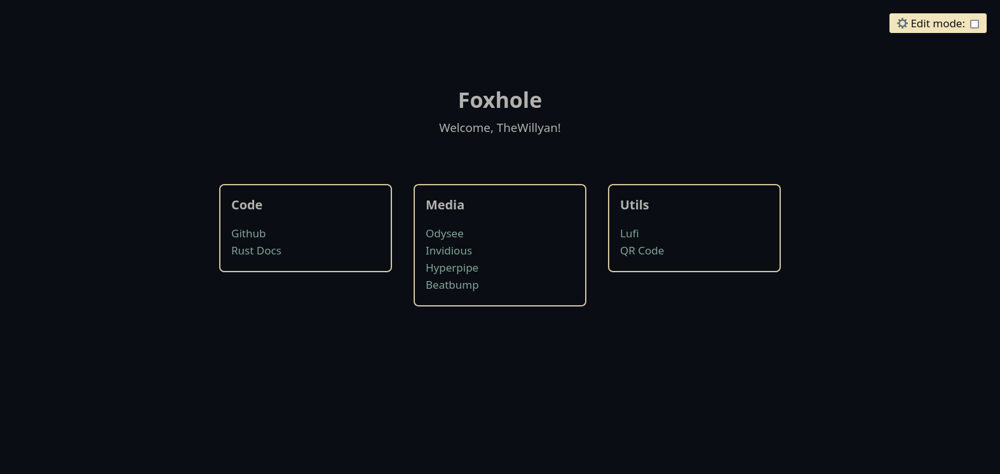
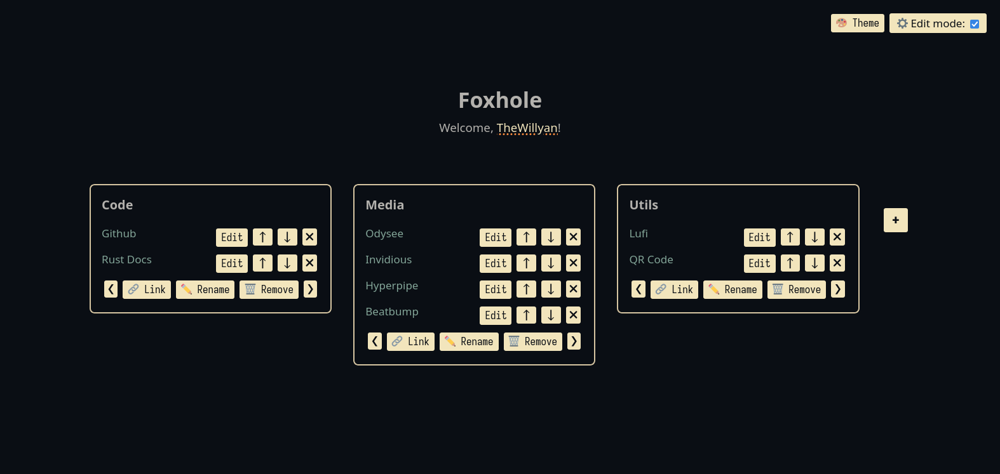
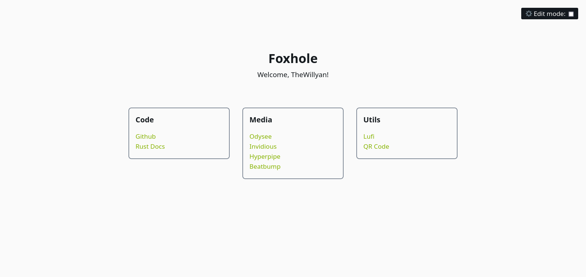
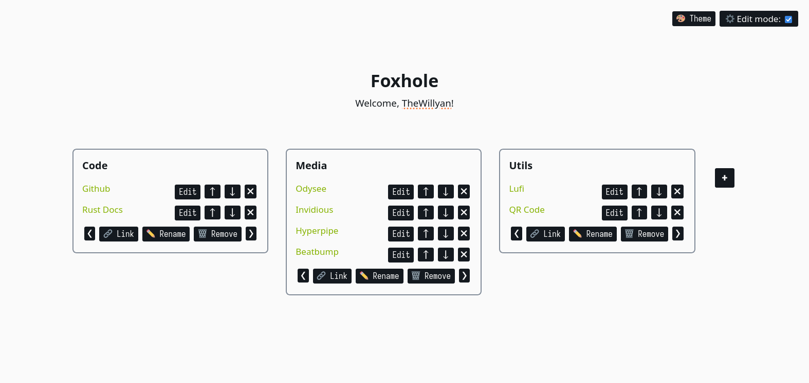

# Foxhole
A simple bookmark manager as a start page for your browser. Heavily inspired
by the [ayu](https://github.com/ayu-theme/) and 
[moonbow](https://github.com/arturgoms/moonbow.nvim) themes.

## Setup
You can set the [official URL](https://thewillyan.github.io/foxhole/) as your
homepage on almost every browser through the settings.

<b>Firefox</b>

Go to `Settings > Home > New Windows and Tabs > Custom URLs`
and then copy and paste the Foxhole URL in the input field.

<b>Chrome</b>

For any chromium based browsers you should go to 
`Menu > Settings > Appearance > Show home button > New tab page`
and then copy and paste the Foxhole URL in the input field.

## Overview

## Build with
- [Rust](https://www.rust-lang.org/) - Programming language
- [Yew](https://yew.rs/) - Framework
- [Trunk](https://trunkrs.dev/) - WASM web application bundler
